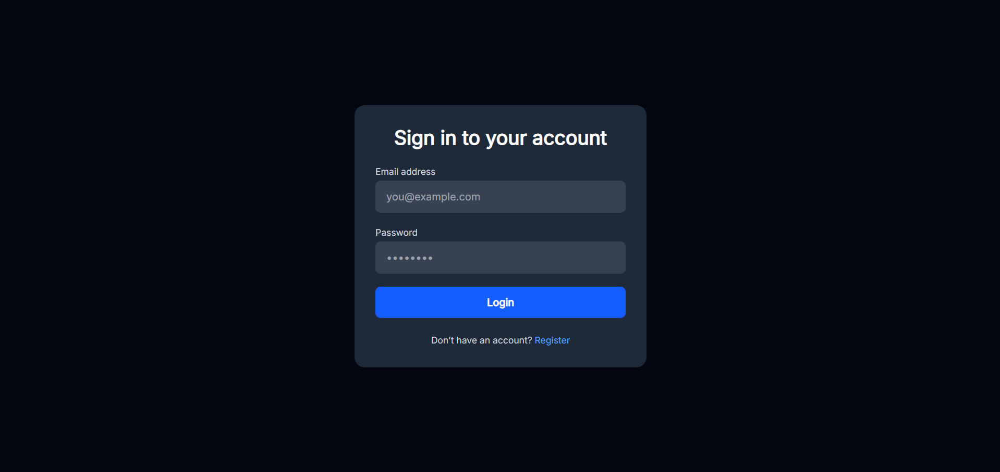
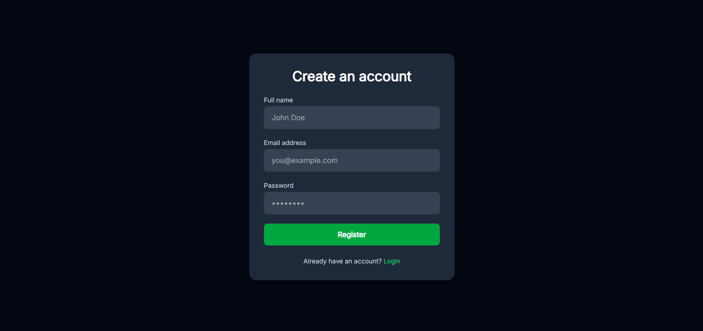
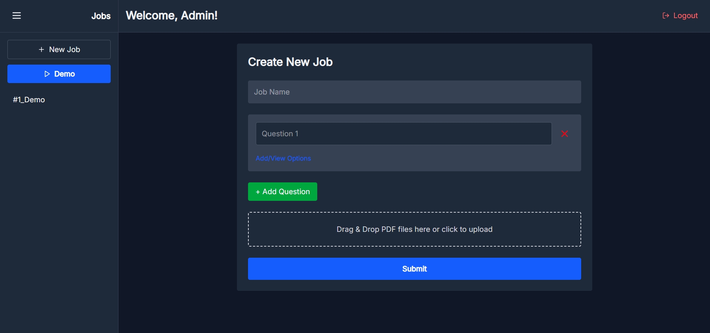
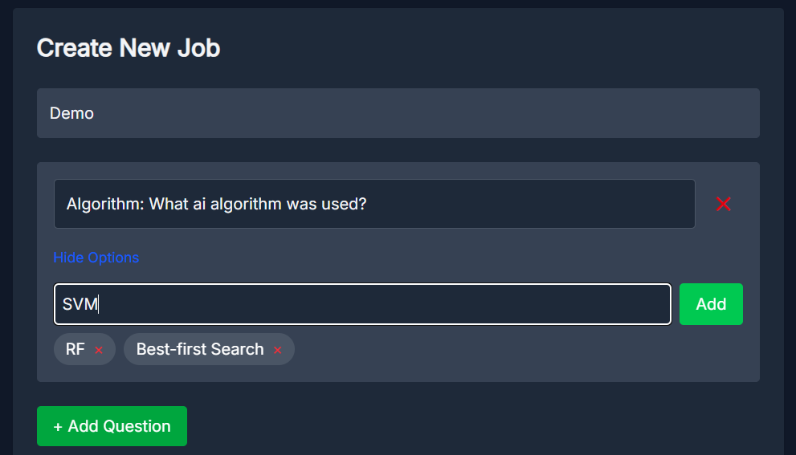
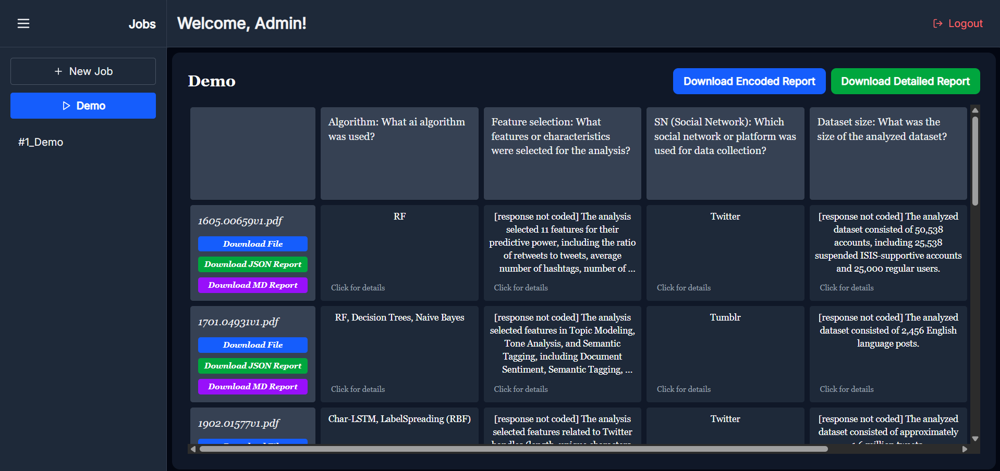
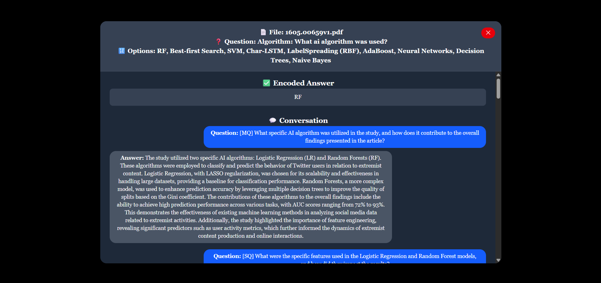
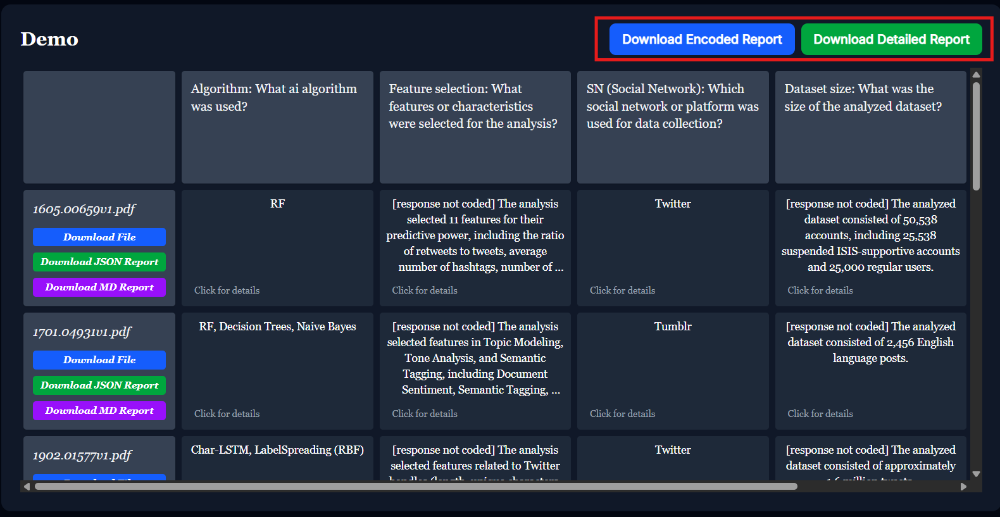
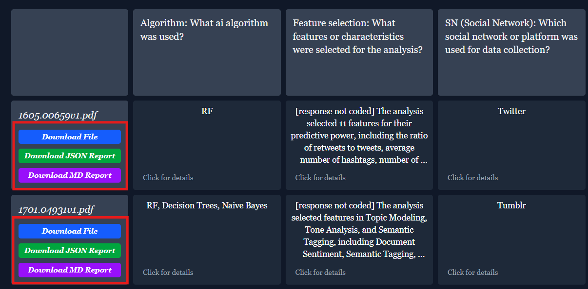

# Application Setup and Run Instructions

## Requirements

To run this application, you need the following:

- [Docker](https://www.docker.com/) installed on your system
- Python 3.13 (required for development or running outside of Docker)

## Setup Instructions

1. **.env File**  
Create a `.env` file in the root directory of the project. This file must contain the following environment variables:

    ```env
    POSTGRES_USER=
    POSTGRES_PASSWORD=
    POSTGRES_DB=
    POSTGRES_HOST=
    POSTGRES_PORT=

    DATABASE_URL=
    CELERY_BROKER_URL=
    CELERY_RESULT_BACKEND=

    SECRET_KEY=

    OPENAI_API_KEY=
    LLAMA_PARSE_API_KEY=
    GEMINI_API_KEY=

    FRONTEND_ADMIN_PASSWORD=
    ```

2. **Run the Application**  
Use the following command to build and start the application using Docker Compose:

    ```bash
    docker-compose up --build
    ```

## 📸 Screenshots

Below are some screenshots showcasing the functionality and UI of the **mies-rag-app**:

### 1. 🔐 Login Page

Email and password login form.


---

### 2. 📝 Register Page

Register with full name, email, and password.


---

### 3. 📋 Dashboard

Main dashboard where you can create a form and upload `.pdf` files for analysis.


---

### 4. ➕ Add Single Question

Add a single question to the form, with an optional field to specify code values for answers.


---

### 5. 📊 Job Detail View

A detailed view showing a table of answers. You can click each cell to view answer details.


---

### 6. 🔎 Answer Detail View

Detailed breakdown of a selected answer.


---

### 7. 📄 Download Main Report

Download the main report in `.csv` format. Two content options available:

* Only codes
* Full report: includes codes, full answers, and extracted quotations
  

---

### 8. 📥 Download Partial Report & File

Download a partial report and the analyzed file. Two report formats available:

* `.md` (Markdown)
* `.json`
  

